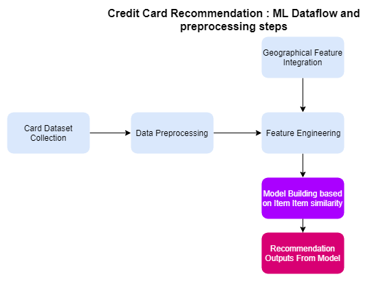
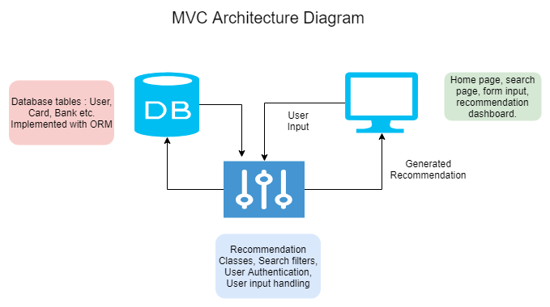
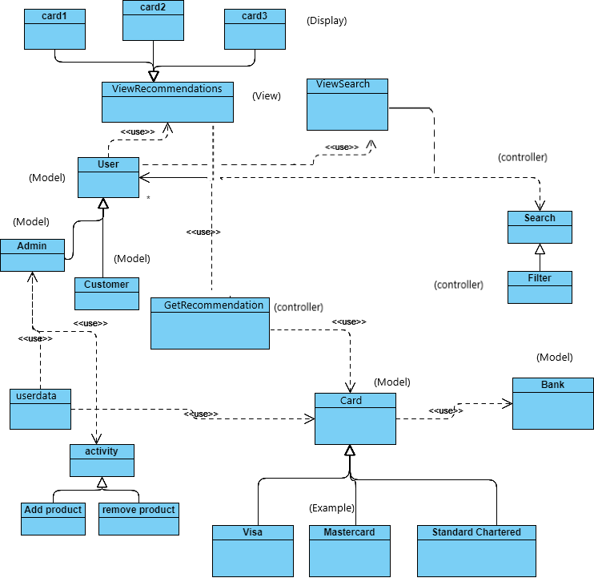
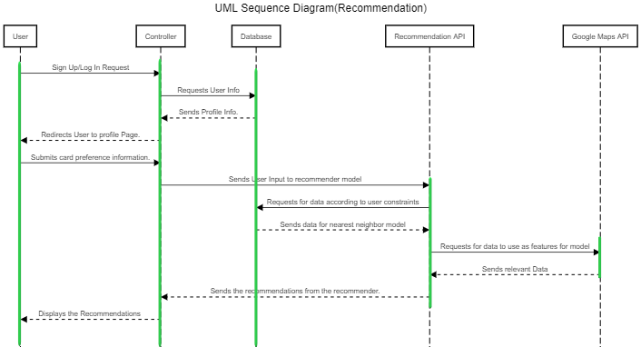
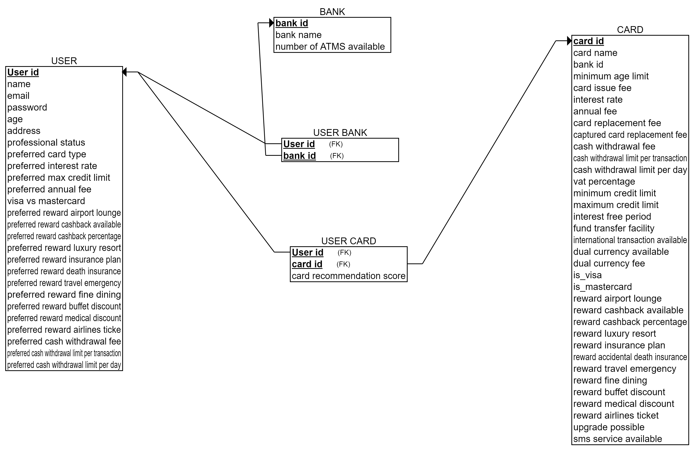

[TOC]

# 1 Introduction

## 1.1 Purpose

This document has the information on the application architecture and backend details for the credit card recommender course project developed by team 2 in CSE 327 Fall 2018 class.

## 1.2 Document Conventions

The document follows standard markdown conventions. Bold/Italics will be used to emphasize key words while important information will be presented using tables.

## 1.3  Intended Audience 

Course instructor, other team members. 

## 1.4 Reading Suggestions

Please use the table of contents to navigate.

# 2 Project Overview 

In this project we are developing a credit card recommender to recommend credit and debit cards to professionals, students and general people. We generate the recommendations using machine learning. User is also able to search through the card database with multiple filtering options enabled. We plan to add a card explorer dashboard with interactive data visualizations for giving users more engagement, but the idea is at its infancy.

# 2.1 Application Architecture 

The final product for this project is a responsive web application which will take user preferences into account and generate recommendations with machine learning. For the web application we use python as the backend language and implement the web application using the **MVC**(Model-View-Controller) paradigm along with machine learning concepts.

Previously, a recommender system would have been implemented with a lot of if then statements and hard coding for the user along with many filters according to user preferences. However, taking a machine learning approach we learn from data which cards might be suitable for a certain user. Since the credit card recommender is a machine learning product first, we will analyze how to implement the ideas of MVC in this context of machine learning.

## 2.2 Recommender Constraints

Recommender systems where we don't already have a large amount of user and item interaction information available suffer from the problem of "cold start". Cold start in this context basically means according to collaborative filtering ideas, for a certain card, if we knew the subset of users who like that card, we could have taken similar users and recommended that card to those similar users who have not used that card yet. In a movie context we may think it as if my taste and my friend's taste in movies are same, a movie that my friend liked but I've not watched is the one I might like too. 

To tackle this situation instead of user-user similarity, we consider item-item similarity first. If we know user preferences, we can take those information, send to the model, and the model will send us the similar cards according to those preferences. A diagram showing how the machine learning pipeline will be implemented is given below.

## 2.3 Model-View-Controller Implementation

Since we have the machine learning intuition for how the product will work behind the scenes, instead of machine learning we will focus on explaining our application architecture MVC and how it fits in with the  ML parts. When considering the backend of our web application, we can consider the recommender as simple component of our backend logic or subset of our controller code. Recommender API also interacts with the model(database), but it does it as part of the controller class which also handles the search functionalities and user authentication. 

In our implementation the model, view and controller is divided like this :

* Model : Consists of the POSTGRESQL database and objects. ORM like SQLAlchemy or Django ORM will be used to implement model classes.
* Controller : Consists of classes for delegating user input to recommendation classes and sending search results and generated recommendations back to the view. Controller will also handle user authentication.
* View : All visual interfaces e.g home page, search page, user profile form input page. 

# 3 UML Class Diagrams

A simplified view of how the model, view and controller classes interact are shown below with UML class diagrams. View classes have been clearly separated from the model and controller. Controller exchanges data between the model and view when using the GetRecommendation class. Again, search functionalities will be implemented similarly where ViewSearch class will be responsible for showing the search results and controller will exchange data between Search class and ViewSearch. Our fundamental model entities are users and cards to build association between users and credit cards via the recommender.

## 3.1 UML Sequence Diagram

Shows how the user request triggers multiple actions in the backend and how message passing between different components happen until the controller sends the results back to the view. Green bars signal how much time a particular component was active.

# 5 Database Definitions

## List Of Tables

* User
* Card
* Bank
* user_has_bank_account
* bank_has_card

## ER Diagram

## Table Descriptions

|            TABLE: USER (ATTRIBUTES)             |                  Description of Attributes                   |
| :---------------------------------------------: | :----------------------------------------------------------: |
|                     User id                     |              Id of user to log in (Primary key)              |
|                      name                       |                       Name of the user                       |
|                      email                      |                    Email used for sign up                    |
|                    password                     |                  User's password to log in                   |
|                    is_admin                     |                   Boolean. True or False.                    |
|                       age                       |                          User's age                          |
|                     address                     |                        User's address                        |
|               professional status               |                    Current status of user                    |
|               preferred card type               |                       credit vs debit                        |
|             preferred interest rate             |    how much credit interest rate is preferred by the user    |
|           preferred max credit limit            |      what is the max credit limit tolerable to the user      |
|              preferred annual fee               |          how much annual fee is user willing to pay          |
|               visa vs master card               |          whether the user wants visa or mastercard           |
|         preferred reward airport lounge         |            if user wants airport lounge as reward            |
|       preferred reward cashback available       |                if user wants cashback or not                 |
|      preferred reward cashback percentage       |         how much cashback percentage user wants etc          |
|         preferred reward luxury resort          |            if the user wants discount to resorts             |
|         preferred reward insurance plan         |          if the user needs insurance plan discount           |
|        preferred reward death insurance         |             if the user requires death insurance             |
|        preferred reward travel emergency        |       if the user requires travel emergency assistance       |
|          preferred reward fine dining           |          if the user requires fine dining discount           |
|        preferred reward buffet discount         |             if the user requires buffet discount             |
|        preferred reward medical discount        |            if the user requires medical discount             |
|        preferred reward airlines ticket         |             if the user requires airlines ticket             |
|          preferred cash withdrawal fee          |     how much cash withdrawal fee is expected by the user     |
| preferred cash withdrawal limit per transaction | how much cash withdrawal limit is minimally required by the user for each transaction |
|     preferred cash withdrawal limit per day     | how much cash withdrawal limit is minimally required by the user per day |

|       TABLE: CARD (ATTRIBUTES)        |                  DESCRIPTION OF ATTRIBUTES                   |
| :-----------------------------------: | :----------------------------------------------------------: |
|                card id                |                    card id (Primary Key)                     |
|               card name               |                         name of card                         |
|               card type               |                  if card is credit or debit                  |
|               bank name               |      bank the card is from, foreign key from bank table      |
|        cardholder minimum age         |                minimum age for card approval                 |
|            card issue fee             |                fee required for issuing card                 |
|             interest rate             |              interest rate for the credit card               |
|              annual fee               |                 annual fee given to the bank                 |
|         card replacement fee          |           card replacement fee if the card is lost           |
|     captured card replacement fee     | card replacement fee if the card is captured in an ATM machine |
|          cash withdrawal fee          |           cash withdrawal fee for each transaction           |
| cash withdrawal limit per transaction | maximum amount of money that can be withdrawn in one transaction |
|     cash withdrawal limit per day     |    maximum amount of money that can be withdrawn per day     |
|            vat percentage             |              annual VAT percentage for the card              |
|         minimum credit limit          |            minimum credit limit for credit cards             |
|         maximum credit limit          |                maximum amount of credit limit                |
|         interest free period          |                interest free period in months                |
|        fund transfer facility         | boolean . whether the card can transfer fund with other cards |
|  international transaction available  | boolean. if card can be used for international transaction.  |
|        dual currency available        |    boolean. if card can be used for multiple currencies.     |
|           dual currency fee           |                           boolean                            |
|                is_visa                |                    if card is visa or not                    |
|             is_mastercard             |                 if card is mastercard or not                 |
|         reward airport lounge         |       if card rewards users with airport lounge usage        |
|       reward cashback available       |            if card has cashback available or not             |
|      reward cashback percentage       |               percentage of cashback available               |
|         reward luxury resort          |                if card awards resort discount                |
|         reward insurance plan         |           if card awards discounted insurance plan           |
|   reward accidental death insurance   |             if card awards death insurance plan              |
|        reward travel emergency        |         if card awards emergency help during travel          |
|          reward fine dining           |        if card awards fine dining experience discount        |
|        reward buffet discount         |                if card awards buffet discount                |
|        reward medical discount        |               if card awards medical discount                |
|        reward airlines ticket         |                if card awards airlines ticket                |
|           upgrade possible            |                if card has upgraded versions                 |
|         sms service available         |              if card has sms based transactions              |

| TABLE: BANK (ATTRIBUTES) | DESCRIPTION OF ATTRIBUTES |
| :----------------------: | :-----------------------: |
|         bank id          |      Id of the bank       |
|        bank name         |       name of bank        |
| number of ATMS available |      Available ATMs       |

| TABLE: USER BANK (ATTRIBUTES) |   DESCRIPTION OF ATTRIBUTES    |
| :---------------------------: | :----------------------------: |
|            User id            | foreign key(from table 'USER') |
|            bank id            | foreign key(from table 'BANK') |

| TABLE: USER CARD (ATTRIBUTES) |     DESCRIPTION OF ATTRIBUTES     |
| :---------------------------: | :-------------------------------: |
|            User id            |  foreign key(from table 'USER')   |
|            bank id            |  foreign key(from table 'BANK')   |
|   card recommendation score   | AI will recommend a card for user |

# 4 Technical Stack

## Front End

HTML,CSS, Bootstrap, Vue.js/Angular.js

## Back End

Flask/Django, Python.

## Machine Learning

Python packages : Scikit-learn, Surprise(Recommender Systems package)

## Deployment

Docker and Heroku.

# 5 Work Plan 

## Task List and Assignee Name

| Task Name                                        | Assignee   |
| ------------------------------------------------ | ---------- |
| Building Recommender Engine + project management | Mayeesha   |
| Front end development + backend management       | Sakib      |
| Data collection for recommender system           | Novera     |
| Backend Development + Database Work              | Pranto     |
| Database primary management                      | Tashfique. |

